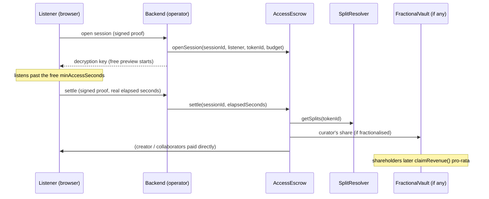

# AfroMeet

**Own the work. Get paid every time it's experienced.**

A decentralised platform for African creatives — musicians, filmmakers, writers, visual artists, photographers, from Lagos to Nairobi to Kinshasa — to own, monetise, and govern their creative work onchain, with payments settled as **USDC nanopayments on Arc**.

The logo is a **cowrie shell** — Africa's original small change, the continent's answer to the lepton.

---

## Table of contents

- [The crux](#the-crux)
- [Features](#features)
- [Architecture](#architecture)
- [Repo layout](#repo-layout)
- [Smart contracts](#smart-contracts)
- [Backend API](#backend-api)
- [Frontend](#frontend)
- [Getting started](#getting-started)
- [Testing](#testing)
- [Security](#security)
- [Deployed — Arc Testnet](#deployed--arc-testnet)
- [Known limitations & roadmap](#known-limitations--roadmap)
- [Links](#links)

---

## The crux

Three things, all paid for with Circle nanopayments:

1. **Fractional ownership** — buy a portion of a song, film, photo or artwork. A work NFT is locked in a `FractionalVault` and split into ERC-20 shares; per-access revenue flows to share holders pro-rata.
2. **Per-access streaming** — pay per play / watch / read / view. No subscription. A Lagos stream and a Stockholm stream pay the **same** rate, settled to the creator in under 500ms.
3. **Euterpe, an autonomous Patron Agent** — AfroMeet's resident selector (named for the muse of music). An AI agent with its own Circle wallet and a USDC budget that discovers creators, samples their work via x402 nanopayments, evaluates them (Claude judgment + on-chain revenue momentum), and backs the promising ones by buying fractional shares and streaming — with an on-chain **ERC-8004** identity and reputation.

The structural problem: one million Spotify streams in Nigeria pays ~$300; the same in Sweden pays up to $10,000. AfroMeet on Arc bypasses territorial/platform pricing entirely — the smallest unit of value (a single play) becomes sellable for the first time.

---

## Features

### 🎙 Own your work, on your terms

- Mint music, film, writing, photography, or art as an ERC-721 (`AfroMeetNFT`). A creator's **first mint** auto-provisions their whole ecosystem in one shot: a governance token (VIBE), an isolated DAO, and a treasury.
- **Single-signature minting** — `mintWorkWithSetup` mints the work, sets its access price/rate, and sets royalty splits in **one wallet signature**, instead of three separate transactions (mint → configure access → set splits).
- **Royalty splits** down to the basis point (`SplitResolver`) — pay collaborators automatically on every settlement. Splits lock immutably after the first sale, so a creator can't quietly rewrite a collaborator's cut once money starts flowing.
- **Secondary-sale royalties** (EIP-2981-shaped, `AfroMeetRoyalty`), enforced through the on-chain `AfroMeetMarketplace`.

### ⚡ Get paid per play — real per-second nanopayments

- Two access modes: **TIMED** (streaming — billed per second actually consumed) and **DISCRETE** (a flat one-time unlock, for an article, photo, etc).
- Pressing play opens a metered session against a pre-authorised USDC budget (`AccessEscrow`). The first `minAccessSeconds` are a **free, skip-gated preview** — stop before then and nothing is charged. Keep listening, and stopping settles for the _exact_ elapsed time, not a flat fee.
- Settlement is **signature-authenticated directly from the listener's wallet** (no shared operator secret ever reaches the browser) — a message proves you're the session's real listener, so nobody can settle, forge, or hijack someone else's session.
- Every settlement **splits automatically on-chain**: creator + collaborators (per `SplitResolver`) + 1% to the creator's DAO treasury.
- Non-holders can sample gated work through **x402** (HTTP 402 Payment Required) discovery pricing — this is also how Euterpe sources her first taste of a work.
- A `beforeunload`/`pagehide` safety net best-effort settles an abandoned session (tab closed mid-stream), so a creator isn't left completely unpaid if a listener never clicks Stop.

### 🧩 Fractional ownership

- Any work can be locked into a `FractionalVault` and split into a fixed-supply ERC-20 share token (`FractionalVaultFactory`) — one vault per (NFT, tokenId).
- The curator sells shares directly to fans and patrons (`buyShares`) for instant upfront USDC — capital today, instead of waiting for streams to trickle in.
- Every subsequent access payment for that work is **routed into the vault** and distributed **pro-rata to shareholders** via a pull-based cumulative-per-share accumulator (`claimRevenue`) — patronage that pays out, and that you can resell.
- **Curator-gated revenue routing**: only the curator's _own_ split share follows them into a vault they created. A third party who buys the NFT and fractionalises it can't redirect a collaborator's or the original creator's revenue — the destination is derived from on-chain authority (the vault's immutable `curator`), never from caller input.
- Fractionalising **after** a work has already earned still works — routing is resolved at settlement time, not frozen at mint.
- A **100%-holder can `redeem()`** — dissolve the vault, reclaim the underlying NFT, and sweep any residual revenue. A redeemed vault is detected and skipped by the router so funds are never stranded in a dead vault.

### 🏛 Creator governance (per-creator DAOs, not a platform token)

- Every creator gets an **isolated `CreatorDAO`** (OpenZeppelin Governor) the moment they mint their first work — fans vote with _that creator's own_ `CreatorVibeToken` (VIBE), never a shared platform token.
- **Buy VIBE** — any fan can spend USDC (**1 VIBE = 1 USDC**) straight into a creator's treasury and receive governance power in return, auto-delegated client-side so it counts as voting weight immediately (no separate delegate step).
- Treasury disbursements are governed by proposal + vote, then held behind a **24-hour timelock** between a passed proposal and execution.
- The client's DAO panel has a **creator selector** — browse and participate in _any_ creator's ecosystem, not just your own, so fans can support creators they don't personally hold work from.

### 🎧 Euterpe — the autonomous Patron Agent

- Named for the muse of music. She has her own **Circle developer-controlled wallet**, her own daily USDC budget, and an on-chain identity + reputation via **ERC-8004**.
- Runs a `discover → sample → evaluate → back → record reputation` loop, every 30 minutes on a cron or on-demand: browses the live catalogue, pays **real discovery nanopayments** to sample works, has **Claude** score each one against on-chain access-revenue momentum, and backs the ones she believes in by buying fractional shares.
- Deterministic guardrails (budget caps, share math, settlement) stay in code — Claude supplies judgment, not arithmetic.
- Every decision is public in her **picks feed** — what she sampled, what she skipped, what she paid, and why. Nothing about her spending is scripted for the demo.
- A second **x402 services leg** lets her autonomously discover and pay for _external_ paid APIs (research inputs, RFB-01) via Circle's x402 marketplace, on Base Sepolia with free testnet USDC.

### 🛍 Marketplace

- List, buy, and resell whole work NFTs for USDC (`AfroMeetMarketplace`); 2% of every sale routes to a cultural-preservation pool.

---

## Architecture

| Layer          | Stack                                 | Responsibility                                                                          |
| -------------- | ------------------------------------- | --------------------------------------------------------------------------------------- |
| Contracts      | Solidity, Foundry, OpenZeppelin       | NFT minting, royalty splits, DAO governance, treasury, access escrow, fractional vaults |
| Payments       | Circle Gateway, x402, Arc             | Per-access USDC settlement, gasless batching                                            |
| Backend        | NestJS, ethers, Circle SDK, Anthropic | x402 discovery, session settlement, Euterpe (the Patron Agent)                          |
| Frontend       | Next.js, Privy, ethers, Tailwind      | Landing + authenticated workspace (Discover, Studio, Market, DAOs, Earnings, Euterpe)   |
| Agent identity | ERC-8004 (Arc)                        | On-chain agent identity + reputation                                                    |

**How a payment moves**, end to end for a TIMED (streaming) work:



See [contracts/README.md](contracts/README.md), [backend/README.md](backend/README.md), and [client/README.md](client/README.md) for module-level detail.

---

## Repo layout

```
afromeet/
├── contracts/           Foundry project — 12 Solidity contracts, 100 tests, deploy script
│   ├── src/              AfroMeetNFT, AccessEscrow, AccessRegistry, SplitResolver,
│   │                      FractionalVault(Factory), CreatorDAO(Factory), CreatorVibeToken,
│   │                      DAOTreasury, AfroMeetRoyalty, AfroMeetMarketplace
│   ├── test/             Foundry tests (100% branch coverage on the payment-critical contracts)
│   └── script/           DeployAfroMeet.s.sol — full-suite deploy + ArcScan verification
├── backend/              NestJS API — Circle wallets, x402, access settlement, Euterpe
│   └── src/               access, agent, blockchain, circle, creator, dao, media-vault, works, services
│                          Swagger docs at /docs when running
├── client/               Next.js 16 frontend — landing + authenticated workspace
│   ├── components/        MediaPlayer, MintForm, MarketplacePanel, DaoPanel, CreatorDashboard,
│   │                      AgentMonitor, AgentPicks, PaymentHistory, OnAirConsole
│   └── lib/wallet.ts      Network auto-switch + smart-allowance helpers, used everywhere
└──  agent-card.json       ERC-8004 agent metadata (Euterpe, agent id 839408)
```

---

## Smart contracts

| Contract                                     | Role                                                                                                                                                                                                   |
| -------------------------------------------- | ------------------------------------------------------------------------------------------------------------------------------------------------------------------------------------------------------ |
| `AfroMeetNFT`                                | Core ERC-721 for works. First mint auto-creates a creator's ecosystem (VIBE, DAO, treasury). Hosts `mintWork`, `mintWorkWithSetup` (single-signature mint), and `buyVibe` (fan governance-token sale). |
| `AccessRegistry`                             | Per-work access config: mode (TIMED/DISCRETE), price, discovery price, minimum seconds, DAO treasury.                                                                                                  |
| `AccessEscrow`                               | Settles per-access payments. Opens metered sessions, settles for elapsed time, splits the payout, and routes a fractionalised curator's share into their vault.                                        |
| `SplitResolver`                              | On-chain royalty-split registry — (recipient, basisPoints) tuples per work; locks after first settlement.                                                                                              |
| `FractionalVaultFactory` / `FractionalVault` | Locks an NFT, mints fixed-supply ERC-20 shares, distributes routed revenue pro-rata, supports primary share sale and 100%-holder redemption.                                                           |
| `CreatorDAOFactory` / `CreatorDAO`           | Deploys and runs a per-creator OpenZeppelin Governor — proposals, voting, quorum.                                                                                                                      |
| `CreatorVibeToken`                           | Per-creator ERC-20 governance token (ERC20Votes) — minted on work mints and VIBE purchases.                                                                                                            |
| `DAOTreasury`                                | Holds a creator DAO's 1% revenue cut; disbursements are proposal-gated and timelocked 24h.                                                                                                             |
| `AfroMeetRoyalty`                            | EIP-2981-shaped secondary-sale royalty registry.                                                                                                                                                       |
| `AfroMeetMarketplace`                        | List/buy/resell work NFTs in USDC; 2% cultural-preservation cut on every sale.                                                                                                                         |

All contracts are Foundry-tested (100 tests), deployed and verified on Arc Testnet

---

## Backend API

Full interactive docs (Swagger) are served at **`/docs`** when the backend is running. Summary:

| Method   | Path                                                        | What it does                                                                   |
| -------- | ----------------------------------------------------------- | ------------------------------------------------------------------------------ |
| GET      | `/` , `/health`                                             | Liveness + Arc/Circle wallet readiness                                         |
| GET      | `/usdc/:address/balance`                                    | Server-side USDC balance read (avoids browser CORS on the Arc RPC)             |
| GET      | `/access/catalogue`                                         | Every active work on-chain, with pricing, title/category, and vault state      |
| GET      | `/access/config/:tokenId`                                   | A single work's access config                                                  |
| POST     | `/access/session/open`                                      | Open a metered streaming session (listener-signed)                             |
| GET      | `/access/session/heartbeat`                                 | Live accrued-cost preview while listening                                      |
| GET      | `/access/session/:sessionId/content`                        | Release the decryption key for an open session                                 |
| POST     | `/access/session/settle`                                    | **Operator-only** (shared-secret guarded) settlement                           |
| POST     | `/access/session/settle/listener`                           | **Listener-authenticated** settlement — signature-verified, no operator secret |
| GET      | `/access/:tokenId`                                          | x402 discovery gate (402 until paid, then returns content)                     |
| GET      | `/works/upload`, `/works/:tokenId/link`                     | Encrypt + pin a work to IPFS; bind the key to a minted tokenId                 |
| GET      | `/creator/:address/earnings`                                | Total on-chain earnings + access count                                         |
| GET      | `/creator/:address/payments`                                | Recent settlements, newest first (the payment-history feed)                    |
| GET/POST | `/dao/:creator/treasury`, `/proposals`, `/vote`, `/propose` | Read a creator DAO's state; build unsigned vote/propose transactions           |
| GET      | `/agent/status`, `/agent/picks`                             | Euterpe's wallet/reputation status and her recommendation feed                 |
| POST     | `/agent/run`                                                | Manually trigger one autonomous pass                                           |
| GET/POST | `/services/search`, `/inspect`, `/pay`                      | x402 paid-API marketplace (Euterpe's research leg)                             |

---

## Getting started

Prerequisites: Node.js 20+, pnpm, Foundry (`forge`), a funded Arc Testnet wallet.

```bash
git clone https://github.com/7maylord/afromeet.git && cd afromeet

# 1. Contracts (optional — the addresses below are already deployed)
cd contracts && forge install && forge build && forge test

# 2. Backend
cd ../backend
pnpm install
cp .env.example .env   # fill contract addresses, Circle keys, Anthropic key, etc.
pnpm start:dev         # http://localhost:3000 · Swagger at /docs

# 3. Client
cd ../client
pnpm install
cp .env.example .env   # fill NEXT_PUBLIC_* addresses + Privy app id
pnpm dev               # http://localhost:3001
```

See [backend/README.md](backend/README.md) and [client/README.md](client/README.md) for the full environment variable reference.

---

## Testing

```bash
cd contracts && forge test       # 100 tests
cd backend    && pnpm test       # 23 tests (jest)
```

Contract coverage is 100% (lines/statements/branches/functions) on every contract in the payment-critical path: `AccessEscrow`, `AccessRegistry`, `AfroMeetNFT`, `SplitResolver`. Backend tests cover calldata round-tripping, per-second meter math, the x402 nanopayment guard, and signature verification for both session-open and listener-settlement.

---

## Security

- **DAO-treasury resolution is on-chain, not caller-supplied** — `AccessRegistry.setConfig` resolves the 1% DAO cut from the creator's own ecosystem, so it can't be redirected by whoever calls it.
- **Curator-gated vault routing** — a fractionalised work's revenue only follows its actual curator; buying someone else's NFT and fractionalising it can't divert their split.
- **Signature-authenticated settlement** — `session/settle/listener` verifies the caller's signature matches both the claimed listener _and_ the session's real on-chain listener, so nobody can settle or forge another listener's session. The operator-only `session/settle` route stays behind a separate shared-secret guard for internal use.
- **Splits lock after first settlement** — a creator cannot quietly rewrite a collaborator's payout once revenue has started flowing.
- **Reentrancy guards** on every value-transferring contract (`AccessEscrow`, `FractionalVault`, `DAOTreasury`, `AfroMeetMarketplace`).
- **Media keys never touch public metadata** — masters are AES-256-GCM encrypted at upload; only the ciphertext is pinned to public IPFS, and the key is held server-side, released only after payment verifies.

---

## Deployed — Arc Testnet (chain `5042002`)

| Contract                | Address                                                                                                                        |
| ----------------------- | ------------------------------------------------------------------------------------------------------------------------------ |
| AfroMeetNFT             | [`0x770eb5208ea21995e5afad1ad50f23300a66e73a`](https://testnet.arcscan.app/address/0x770eb5208ea21995e5afad1ad50f23300a66e73a) |
| AccessRegistry          | [`0x4f2b0bce212690b4d0ea92ed528cebf00f62a8cd`](https://testnet.arcscan.app/address/0x4f2b0bce212690b4d0ea92ed528cebf00f62a8cd) |
| AccessEscrow            | [`0x668c60e379209a79803bbe033ea8d0ae593087b0`](https://testnet.arcscan.app/address/0x668c60e379209a79803bbe033ea8d0ae593087b0) |
| SplitResolver           | [`0x24da8b01d81b925eb15aa13a539958cc5d602c70`](https://testnet.arcscan.app/address/0x24da8b01d81b925eb15aa13a539958cc5d602c70) |
| AfroMeetRoyalty         | [`0xb6057af5923697ba3cfb558e2d6fcc2628cccd9c`](https://testnet.arcscan.app/address/0xb6057af5923697ba3cfb558e2d6fcc2628cccd9c) |
| AfroMeetMarketplace     | [`0xea54d613646d5032bd0c9ea19e35c0db23fca27a`](https://testnet.arcscan.app/address/0xea54d613646d5032bd0c9ea19e35c0db23fca27a) |
| FractionalVaultFactory  | [`0x5412f0d7fea412e0c586ecebadf4833c0aab5e76`](https://testnet.arcscan.app/address/0x5412f0d7fea412e0c586ecebadf4833c0aab5e76) |
| CreatorDAOFactory       | [`0x7a436f6d23170509672652986cfd683e92ddcfd1`](https://testnet.arcscan.app/address/0x7a436f6d23170509672652986cfd683e92ddcfd1) |
| USDC (Arc system token) | [`0x3600000000000000000000000000000000000000`](https://testnet.arcscan.app/address/0x3600000000000000000000000000000000000000) |

All eight are verified on [ArcScan](https://testnet.arcscan.app). Per-creator contracts (`CreatorVibeToken`, `DAOTreasury`, `CreatorDAO`) are deployed dynamically on each creator's first mint, so they don't have fixed addresses.

**Euterpe (Patron Agent)** — ERC-8004 agent id `839408` · identity registry `0x8004A818BFB912233c491871b3d84c89A494BD9e`

- On-chain signer (Circle developer-controlled wallet, Arc): `0xf99337df8acbdce3221372ea41610d38b54ca33f`
- x402 services wallet (Circle CLI agent wallet): `0xde4e3db5135ce706931fb19cfbe53df30ad0100d`

---

## Links

- **Frontend:** https://afromeet.vercel.app
- **Backend:** https://afromeet-production.up.railway.app
- **Explorer:** [Arc Testnet on ArcScan](https://testnet.arcscan.app)
- **Repo:** https://github.com/7maylord/afromeet
